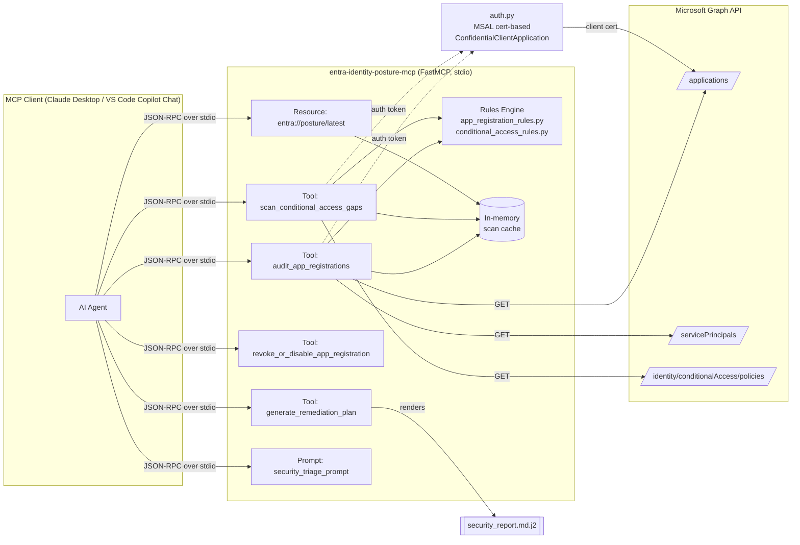

# Entra Identity Posture MCP

[](https://github.com/henrymbuguakiarie/entra-identity-posture-mcp/actions/workflows/ci.yml)

An Agentic Security and Governance [MCP](https://modelcontextprotocol.io/) server built with **FastMCP** and the **Microsoft Graph API** for auditing Microsoft Entra ID app registrations and Conditional Access policies against Zero-Trust principles — and generating dry-run remediation scripts an AI agent (or human) can review and run.

> **Status:** Alpha — under active development. Interfaces and tool surfaces may change.

## Overview

This server exposes Microsoft Entra ID (Azure AD) security posture data as a full MCP surface — **Tools**, a **Resource**, and a **Prompt** — so that AI agents (e.g., Claude Desktop, VS Code Copilot Chat) can:

- Audit app registrations for expiring/long-lived credentials, over-privileged Graph permissions, insecure redirect URIs, and risky multi-tenant configurations
- Scan Conditional Access policies for admin MFA exclusions and policies stuck in report-only mode
- Generate a Markdown Zero-Trust security report plus ready-to-run (dry-run only) Azure CLI / Microsoft Graph PowerShell remediation commands
- Query the most recent scan results directly as an MCP Resource, without re-invoking a tool
- Kick off a guided triage workflow via a predefined MCP Prompt

The server is **read-only** against Microsoft Graph (`Application.Read.All`, `Policy.Read.All`). It never calls a Graph write endpoint — remediation tools only _generate_ text commands for a human or CI pipeline to execute.

### Architecture



## Requirements

- Python 3.12+
- A Microsoft Entra ID app registration configured with a **certificate credential** (client secrets are not supported by `auth.py`)
- Admin-consented Microsoft Graph **application** permissions: `Application.Read.All` and `Policy.Read.All`

## 1. Clone the repository

```bash
git clone https://github.com/henrymbuguakiarie/entra-identity-posture-mcp.git
cd entra-identity-posture-mcp
```

## 2. Install dependencies

Install with [uv](https://docs.astral.sh/uv/) (recommended):

```bash
uv sync
```

Or install with pip:

```bash
pip install -e .
```

Include test and lint tooling for development:

```bash
uv sync --group dev
```

## 3. Create the Entra app registration and certificate credential

Authenticate the server with a **certificate**, not a client secret — `auth.py` only supports MSAL's certificate-based confidential client flow. Complete these steps once, manually; the server does not automate app registration or admin consent.

### 3.1 Register the app

1. Open the [Entra admin center](https://entra.microsoft.com) and go to **Identity → Applications → App registrations**.
2. Select **New registration**, name it (e.g. `entra-identity-posture-mcp`), keep the default single-tenant account type, and select **Register**.
3. Copy the **Application (client) ID** and **Directory (tenant) ID** from the app's **Overview** page — you'll need both for `.env`.

### 3.2 Generate a certificate

Generate the certificate on the machine that will run the server, so the private key never leaves your workstation.

**Windows (PowerShell):**

```powershell
# Generate a self-signed certificate and store it in your user certificate store
$cert = New-SelfSignedCertificate `
  -Subject "CN=entra-identity-posture-mcp" `
  -CertStoreLocation "Cert:\CurrentUser\My" `
  -KeyExportPolicy Exportable `
  -KeySpec Signature `
  -KeyLength 2048 `
  -NotAfter (Get-Date).AddYears(1)

# Export the public certificate to upload to Entra
Export-Certificate -Cert $cert -FilePath "$HOME\entra-mcp-cert.cer"

# Export the private key as a password-protected PFX
$securePwd = Read-Host -Prompt "Set a temporary PFX password" -AsSecureString
Export-PfxCertificate -Cert $cert -FilePath "$HOME\entra-mcp-cert.pfx" -Password $securePwd
```

Convert the PFX to the PEM private key format `auth.py` expects — this requires [OpenSSL](https://openssl.org/), which ships with Git for Windows at `C:\Program Files\Git\mingw64\bin\openssl.exe`:

```bash
openssl pkcs12 -in ~/entra-mcp-cert.pfx -nocerts -nodes -out ~/entra-mcp-cert.key.pem
```

Delete the PFX once you have the PEM file — you no longer need it:

```powershell
Remove-Item "$HOME\entra-mcp-cert.pfx" -Force
```

**macOS/Linux (OpenSSL, cross-platform):**

```bash
# Generate a private key and matching self-signed public certificate in one step
openssl req -x509 -newkey rsa:2048 -keyout entra-mcp-cert.key.pem -out entra-mcp-cert.cer \
  -days 365 -nodes -subj "/CN=entra-identity-posture-mcp"
```

Either path produces two files:

- `entra-mcp-cert.cer` — the **public** certificate. Upload this one to Entra.
- `entra-mcp-cert.key.pem` — the **private** key. Keep this file local and never commit it (see [.gitignore](.gitignore)); `ENTRA_CERT_PATH` points to it.

### 3.3 Upload the certificate

1. Open **Certificates & secrets → Certificates** on your app registration.
2. Select **Upload certificate** and choose `entra-mcp-cert.cer` — upload only the public certificate, never the private key.
3. Copy the certificate's **Thumbprint** after the upload completes — you'll need it for `.env`.

### 3.4 Grant API permissions

1. Open **API permissions → Add a permission → Microsoft Graph → Application permissions**.
2. Add `Application.Read.All` and `Policy.Read.All`, then select **Add permissions**.
3. Select **Grant admin consent for &lt;tenant&gt;** and confirm. Both permissions must show a green check under **Status** before the server can call Graph.

## 4. Configure environment variables

The server authenticates to Microsoft Graph via [MSAL](https://learn.microsoft.com/entra/msal/python/) certificate-based confidential client auth. Copy [.env.example](.env.example) to `.env`:

```bash
cp .env.example .env
```

Fill in the values you collected in step 3:

| Variable                   | Description                                                                             |
| -------------------------- | --------------------------------------------------------------------------------------- |
| `ENTRA_TENANT_ID`          | The **Directory (tenant) ID** from the app registration's Overview page                 |
| `ENTRA_CLIENT_ID`          | The **Application (client) ID** from the app registration's Overview page               |
| `ENTRA_CERT_PATH`          | Path to the PEM-encoded **private key** file (`entra-mcp-cert.key.pem`), not the `.cer` |
| `ENTRA_CERT_THUMBPRINT`    | Thumbprint of the certificate you uploaded to the app registration                      |
| `IMMINENT_EXPIRATION_DAYS` | Days-until-expiry threshold for the `IMMINENT_EXPIRATION` rule (default `30`)           |
| `EXCESSIVE_LIFESPAN_DAYS`  | Max credential lifespan in days before flagging `EXCESSIVE_LIFESPAN` (default `180`)    |

> ⚠️ `ENTRA_CERT_PATH` must point to the PEM **private key**, not the `.cer` file you uploaded to Entra — `auth.py` reads this file and passes its contents to MSAL as the client credential.

## 5. Run the server

Start the MCP server directly over stdio:

```bash
uv run entra-posture-mcp
```

### VS Code (`mcp.json`)

```jsonc
{
  "servers": {
    "entra-identity-posture": {
      "command": "uv",
      "args": ["run", "entra-posture-mcp"],
      "cwd": "${workspaceFolder}",
    },
  },
}
```

### Claude Desktop (`claude_desktop_config.json`)

```jsonc
{
  "mcpServers": {
    "entra-identity-posture": {
      "command": "uv",
      "args": [
        "run",
        "--directory",
        "C:\\Work\\Automation\\entra-identity-posture-mcp",
        "entra-posture-mcp",
      ],
    },
  },
}
```

### MCP surface reference

| Kind     | Name                                 | Description                                                                                                      |
| -------- | ------------------------------------ | ---------------------------------------------------------------------------------------------------------------- |
| Tool     | `audit_app_registrations`            | Scans app registrations for expiring/long-lived secrets, risky permissions, and insecure redirect URIs           |
| Tool     | `scan_conditional_access_gaps`       | Scans Conditional Access policies for admin MFA exclusions and report-only status                                |
| Tool     | `generate_remediation_plan`          | Renders a Markdown Zero-Trust report + dry-run CLI/PowerShell snippets from findings                             |
| Tool     | `revoke_or_disable_app_registration` | Generates a dry-run Azure CLI/PowerShell command to disable sign-in, remove a credential, or remove a permission |
| Resource | `entra://posture/latest`             | Cached JSON from the most recent scan, queryable without re-invoking a tool                                      |
| Prompt   | `security_triage_prompt`             | Predefined Zero-Trust triage prompt to prioritize findings and recommend fixes                                   |

### Sample JSON-RPC request/response

MCP clients talk to the server over stdio using [JSON-RPC 2.0](https://www.jsonrpc.org/specification) — every tool call is one request/response pair on stdin/stdout. Here's what actually crosses the wire when a client calls `revoke_or_disable_app_registration` (captured against this server):

**Request** (client → server, on stdin):

```jsonc
{
  "jsonrpc": "2.0",
  "id": 1,
  "method": "tools/call",
  "params": {
    "name": "revoke_or_disable_app_registration",
    "arguments": {
      "app_id": "abc-123",
      "action": "disable_sign_in",
    },
  },
}
```

**Response** (server → client, on stdout):

````jsonc
{
  "jsonrpc": "2.0",
  "id": 1,
  "result": {
    "content": [
      {
        "type": "text",
        "text": "🔒 Dry-Run Remediation Output for App ID 'abc-123':\n\n```bash\n# PowerShell (MgGraph): Disable user sign-in\nUpdate-MgServicePrincipal -ServicePrincipalId abc-123 -AccountEnabled:$false\n```\n*(Note: Read-only mode active. Run the script manually or via CI pipeline to execute).*",
      },
    ],
    "structuredContent": {
      "result": "🔒 Dry-Run Remediation Output for App ID 'abc-123':\n\n```bash\n# PowerShell (MgGraph): Disable user sign-in\nUpdate-MgServicePrincipal -ServicePrincipalId abc-123 -AccountEnabled:$false\n```\n*(Note: Read-only mode active. Run the script manually or via CI pipeline to execute).*",
    },
    "isError": false,
  },
}
````

The MCP Inspector CLI commands in [step 6](#6-verify-the-server) print just the `result` payload — reproduce the raw envelope above by driving the server directly with the [MCP Python SDK client](https://github.com/modelcontextprotocol/python-sdk), or watch stdin/stdout while a client like Claude Desktop or VS Code Copilot Chat drives it.

### Example agent workflow

```
User: Run a Zero-Trust audit on my Entra tenant and tell me what to fix first.

Agent: [calls audit_app_registrations]
       [calls scan_conditional_access_gaps]
       [calls generate_remediation_plan with the combined findings]

Agent: I found 2 CRITICAL and 3 HIGH severity issues:

       1. [CRITICAL] "Vendor Sync App" has Directory.ReadWrite.All combined with a
          multi-tenant (AzureADMultipleOrgs) sign-in audience.
          → Update-MgApplication -ApplicationId <id>

       2. [CRITICAL] Conditional Access policy "Require MFA for Admins" excludes the
          Global Administrator role from enforcement.
          → Get-MgIdentityConditionalAccessPolicy -ConditionalAccessPolicyId <id>

       Full report and remaining dry-run commands are in the Markdown report above.
       Review each command before running it — nothing has been changed in your tenant.
```

## 6. Verify the server

Before you wire the server into an LLM client, validate the JSON-RPC tool/resource/prompt schemas in isolation using the official [MCP Inspector CLI](https://github.com/modelcontextprotocol/inspector):

```bash
npx @modelcontextprotocol/inspector --cli uv run entra-posture-mcp --method tools/list
npx @modelcontextprotocol/inspector --cli uv run entra-posture-mcp --method resources/list
npx @modelcontextprotocol/inspector --cli uv run entra-posture-mcp --method prompts/list

# Exercise a tool that doesn't require live Graph credentials
npx @modelcontextprotocol/inspector --cli uv run entra-posture-mcp \
  --method tools/call --tool-name revoke_or_disable_app_registration \
  --tool-arg app_id=abc-123 --tool-arg action=disable_sign_in
```

Once you configure `.env` against a real test tenant, run the stdio entrypoint and invoke `audit_app_registrations` / `scan_conditional_access_gaps` to confirm known findings (an expiring secret, a risky permission, or a report-only Conditional Access policy) surface correctly — then repeat the workflow through Claude Desktop or VS Code Copilot Chat using the configs above.

> 📸 Live MCP Inspector CLI session against a real test tenant, captured verbatim (tenant IDs redacted):
>
> ```console
> $ npx @modelcontextprotocol/inspector --cli uv run entra-posture-mcp --method tools/call --tool-name audit_app_registrations
> {
>   "content": [
>     {
>       "type": "text",
>       "text": "Found 6 app registration security issues:\n\n- [HIGH] InsomniaWebApp (fd0486bd-...): Insecure redirect URIs detected: http://localhost.\n- [HIGH] web-api-4 (f7272057-...): Insecure redirect URIs detected: http://localhost.\n- [HIGH] web-app-calls-web-api-2 (5847db6c-...): Insecure redirect URIs detected: http://localhost.\n- [HIGH] identity-web-app (5cad77dc-...): Insecure redirect URIs detected: http://localhost.\n- [MEDIUM] entra-identity-posture-mcp (c712c7f1-...): Credential key_id '5e44aaeb-...' has an excessive lifespan of 365 days.\n- [HIGH] identity-web-app-v1 (eadcc84d-...): Insecure redirect URIs detected: http://localhost."
>     }
>   ],
>   "isError": false
> }
>
> $ npx @modelcontextprotocol/inspector --cli uv run entra-posture-mcp --method tools/call --tool-name scan_conditional_access_gaps
> {
>   "content": [
>     {
>       "type": "text",
>       "text": "✅ Conditional Access scan complete: All policies comply with Zero-Trust standards."
>     }
>   ],
>   "isError": false
> }
> ```
>
> A GIF/screenshot of the same workflow running through Claude Desktop or VS Code Copilot Chat will replace this transcript once captured.

## Development

Run tests:

```bash
uv run pytest
```

Lint and format:

```bash
uv run ruff check .
uv run ruff format .
```

Continuous integration runs `ruff check` and `pytest` on every push/PR via [.github/workflows/ci.yml](.github/workflows/ci.yml).

## Roadmap

Deliberately out of scope for v1:

- **Terraform file generation** (e.g. `azuread_application_password`, `azuread_application_pre_authorized`) for remediation — v1 only emits dry-run Azure CLI / PowerShell snippets.
- **Automated GitHub PR creation** for remediation changes — v1 leaves execution and change management entirely to the human/CI pipeline.

Both are fast-follow candidates once v1 has been validated against a live tenant.

## License

MIT © [Henry Mbugua](https://github.com/henrymbuguakiarie)
