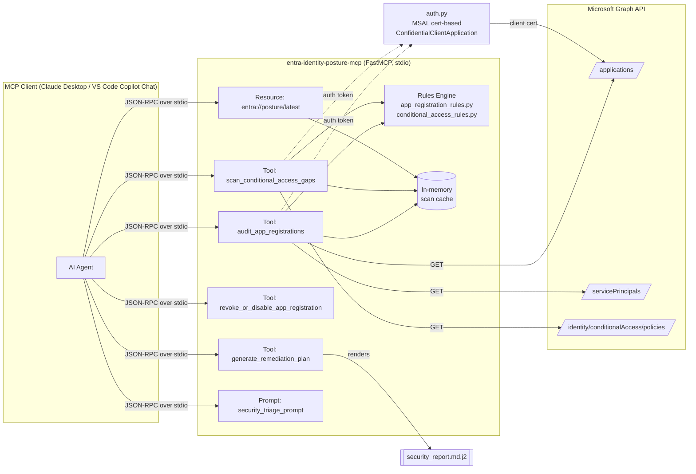

# Entra Identity Posture MCP

[](https://github.com/henrymbuguakiarie/entra-identity-posture-mcp/actions/workflows/ci.yml)

An Agentic Security and Governance [MCP](https://modelcontextprotocol.io/) server built with **FastMCP** and the **Microsoft Graph API** for auditing Microsoft Entra ID app registrations and Conditional Access policies against Zero-Trust principles — and generating dry-run remediation scripts an AI agent (or human) can review and run.

> **Status:** Alpha — under active development. Interfaces and tool surfaces may change.

## Overview

This server exposes Microsoft Entra ID (Azure AD) security posture data as a full MCP surface — **Tools**, a **Resource**, and a **Prompt** — so that AI agents (e.g., Claude Desktop, VS Code Copilot Chat) can:

- Audit app registrations for expiring/long-lived credentials, over-privileged Graph permissions, insecure redirect URIs, and risky multi-tenant configurations
- Scan Conditional Access policies for admin MFA exclusions and policies stuck in report-only mode
- Generate a Markdown Zero-Trust security report plus ready-to-run (dry-run only) Azure CLI / Microsoft Graph PowerShell remediation commands
- Query the most recent scan results directly as an MCP Resource, without re-invoking a tool
- Kick off a guided triage workflow via a predefined MCP Prompt

The server is **read-only** against Microsoft Graph (`Application.Read.All`, `Policy.Read.All`). It never calls a Graph write endpoint — remediation tools only _generate_ text commands for a human or CI pipeline to execute.

### Architecture



## Requirements

- Python 3.12+
- A Microsoft Entra ID app registration configured with a **certificate credential** (client secrets are not supported by `auth.py`)
- Admin-consented Microsoft Graph **application** permissions: `Application.Read.All` and `Policy.Read.All`

### Prerequisite: create the Entra app registration (manual, one-time)

This server does not automate app registration or admin consent — set these up yourself:

1. In the [Entra admin center](https://entra.microsoft.com), create a new **App registration**.
2. Under **Certificates & secrets**, upload a certificate (`.pem`/`.cer`) and note its thumbprint. Keep the matching private key file locally — never commit it (see [.gitignore](.gitignore)).
3. Under **API permissions**, add Microsoft Graph **Application permissions**: `Application.Read.All` and `Policy.Read.All`, then click **Grant admin consent**.
4. Note the **Tenant ID** and **Application (client) ID** from the app registration's Overview page.

## Installation

Using [uv](https://docs.astral.sh/uv/) (recommended):

```bash
uv sync
```

Using pip:

```bash
pip install -e .
```

For development (includes test and lint tooling):

```bash
uv sync --group dev
```

## Configuration

The server authenticates to Microsoft Graph via [MSAL](https://learn.microsoft.com/entra/msal/python/) certificate-based confidential client auth. Copy [.env.example](.env.example) to `.env` and fill in your values:

| Variable                   | Description                                                                          |
| -------------------------- | ------------------------------------------------------------------------------------ |
| `ENTRA_TENANT_ID`          | Your Microsoft Entra tenant ID                                                       |
| `ENTRA_CLIENT_ID`          | Application (client) ID of your app registration                                     |
| `ENTRA_CERT_PATH`          | Path to the PEM-encoded private key for the app's certificate credential             |
| `ENTRA_CERT_THUMBPRINT`    | Thumbprint of the certificate uploaded to the app registration                       |
| `IMMINENT_EXPIRATION_DAYS` | Days-until-expiry threshold for the `IMMINENT_EXPIRATION` rule (default `30`)        |
| `EXCESSIVE_LIFESPAN_DAYS`  | Max credential lifespan in days before flagging `EXCESSIVE_LIFESPAN` (default `180`) |

## Usage

Run the MCP server directly (stdio transport):

```bash
uv run entra-posture-mcp
```

### VS Code (`mcp.json`)

```jsonc
{
  "servers": {
    "entra-identity-posture": {
      "command": "uv",
      "args": ["run", "entra-posture-mcp"],
      "cwd": "${workspaceFolder}",
    },
  },
}
```

### Claude Desktop (`claude_desktop_config.json`)

```jsonc
{
  "mcpServers": {
    "entra-identity-posture": {
      "command": "uv",
      "args": [
        "run",
        "--directory",
        "C:\\Work\\Automation\\entra-identity-posture-mcp",
        "entra-posture-mcp",
      ],
    },
  },
}
```

### MCP surface reference

| Kind     | Name                                 | Description                                                                                                      |
| -------- | ------------------------------------ | ---------------------------------------------------------------------------------------------------------------- |
| Tool     | `audit_app_registrations`            | Scans app registrations for expiring/long-lived secrets, risky permissions, and insecure redirect URIs           |
| Tool     | `scan_conditional_access_gaps`       | Scans Conditional Access policies for admin MFA exclusions and report-only status                                |
| Tool     | `generate_remediation_plan`          | Renders a Markdown Zero-Trust report + dry-run CLI/PowerShell snippets from findings                             |
| Tool     | `revoke_or_disable_app_registration` | Generates a dry-run Azure CLI/PowerShell command to disable sign-in, remove a credential, or remove a permission |
| Resource | `entra://posture/latest`             | Cached JSON from the most recent scan, queryable without re-invoking a tool                                      |
| Prompt   | `security_triage_prompt`             | Predefined Zero-Trust triage prompt to prioritize findings and recommend fixes                                   |

### Example agent workflow

```
User: Run a Zero-Trust audit on my Entra tenant and tell me what to fix first.

Agent: [calls audit_app_registrations]
       [calls scan_conditional_access_gaps]
       [calls generate_remediation_plan with the combined findings]

Agent: I found 2 CRITICAL and 3 HIGH severity issues:

       1. [CRITICAL] "Vendor Sync App" has Directory.ReadWrite.All combined with a
          multi-tenant (AzureADMultipleOrgs) sign-in audience.
          → Update-MgApplication -ApplicationId <id>

       2. [CRITICAL] Conditional Access policy "Require MFA for Admins" excludes the
          Global Administrator role from enforcement.
          → Get-MgIdentityConditionalAccessPolicy -ConditionalAccessPolicyId <id>

       Full report and remaining dry-run commands are in the Markdown report above.
       Review each command before running it — nothing has been changed in your tenant.
```

## Manual verification

Before wiring the server into an LLM client, validate the JSON-RPC tool/resource/prompt schemas in isolation using the official [MCP Inspector CLI](https://github.com/modelcontextprotocol/inspector):

```bash
npx @modelcontextprotocol/inspector --cli uv run entra-posture-mcp --method tools/list
npx @modelcontextprotocol/inspector --cli uv run entra-posture-mcp --method resources/list
npx @modelcontextprotocol/inspector --cli uv run entra-posture-mcp --method prompts/list

# Exercise a tool that doesn't require live Graph credentials
npx @modelcontextprotocol/inspector --cli uv run entra-posture-mcp \
  --method tools/call --tool-name revoke_or_disable_app_registration \
  --tool-arg app_id=abc-123 --tool-arg action=disable_sign_in
```

Once `.env` is configured against a real test tenant, run the stdio entrypoint and invoke `audit_app_registrations` / `scan_conditional_access_gaps` to confirm known findings (an expiring secret, a risky permission, or a report-only Conditional Access policy) surface correctly — then repeat the workflow through Claude Desktop or VS Code Copilot Chat using the configs above.

> 📸 _Screenshot of an MCP Inspector / Claude Desktop session to be added here after manual verification against a live tenant._

## Development

Run tests:

```bash
uv run pytest
```

Lint and format:

```bash
uv run ruff check .
uv run ruff format .
```

Continuous integration runs `ruff check` and `pytest` on every push/PR via [.github/workflows/ci.yml](.github/workflows/ci.yml).

## Roadmap

Deliberately out of scope for v1:

- **Terraform file generation** (e.g. `azuread_application_password`, `azuread_application_pre_authorized`) for remediation — v1 only emits dry-run Azure CLI / PowerShell snippets.
- **Automated GitHub PR creation** for remediation changes — v1 leaves execution and change management entirely to the human/CI pipeline.

Both are fast-follow candidates once v1 has been validated against a live tenant.

## License

MIT © [Henry Mbugua](https://github.com/henrymbuguakiarie)
